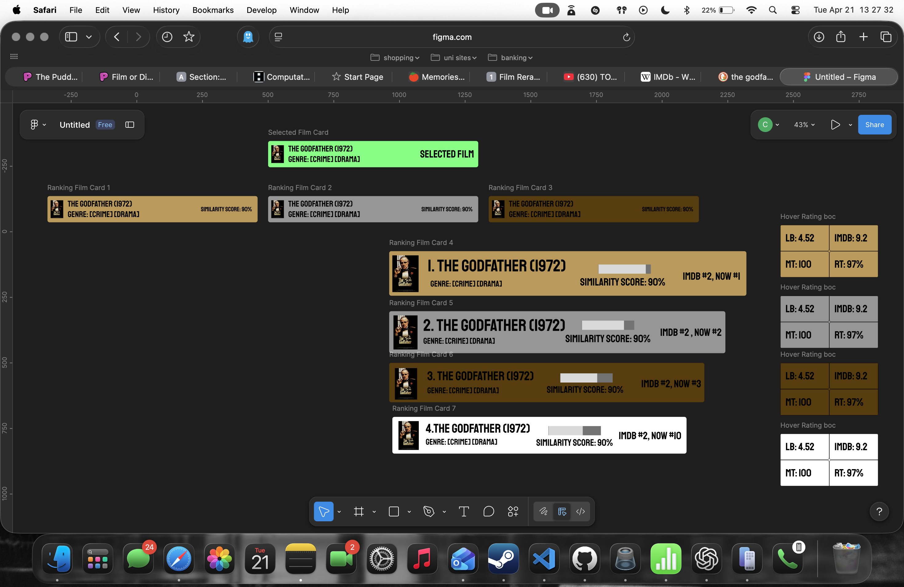
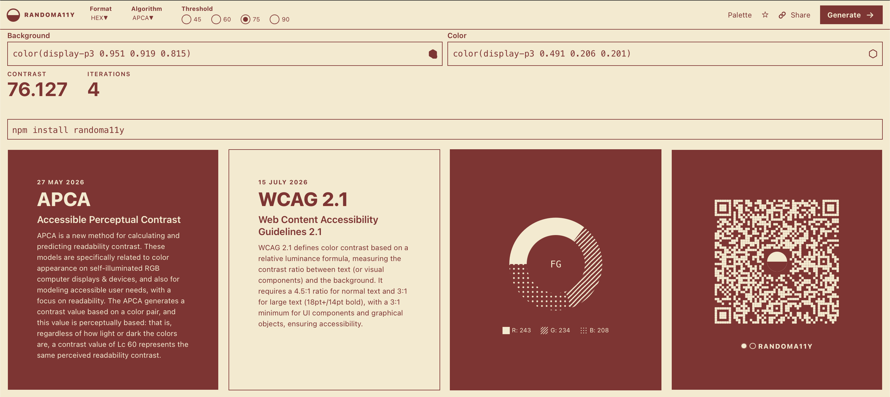
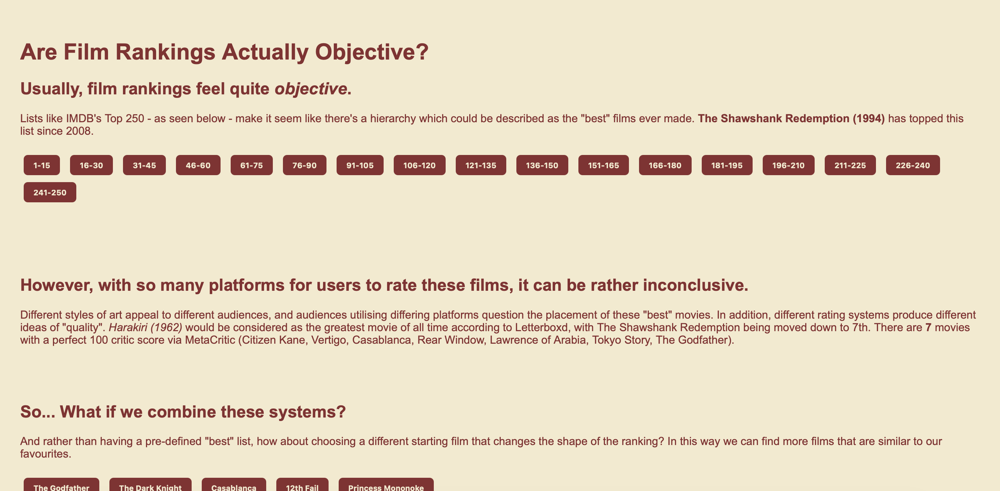
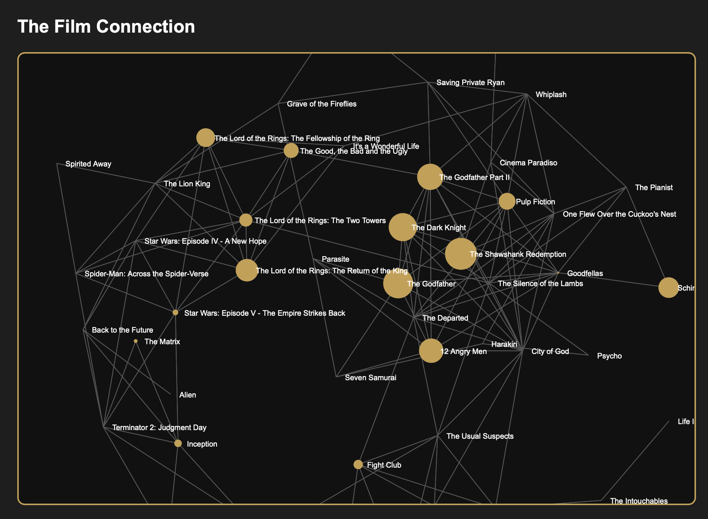
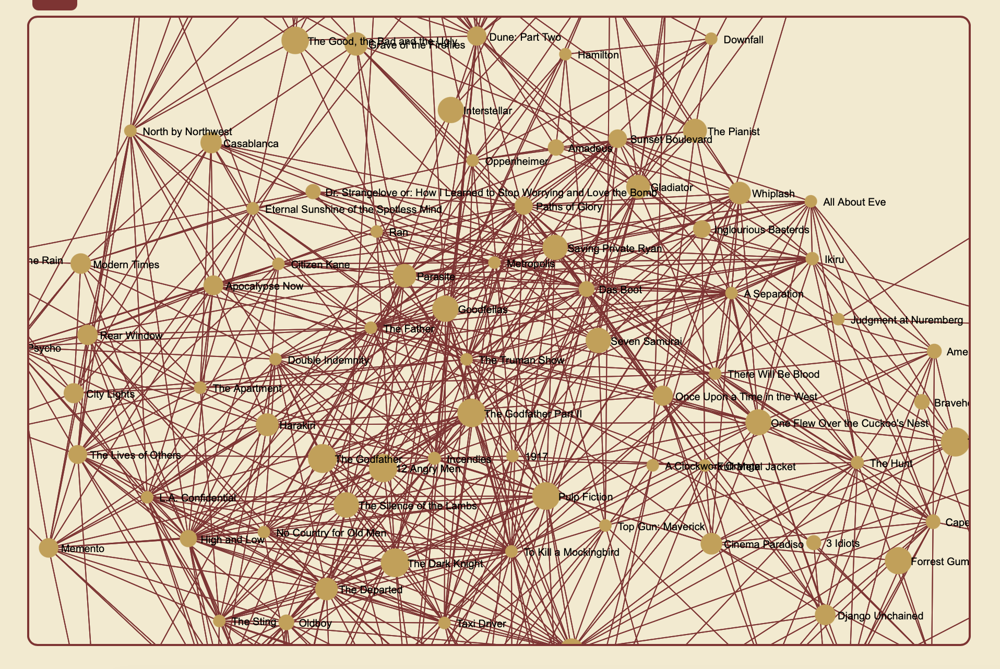

# Visualisation and Sensing 2026

### Project Question
How objective are film rankings when different platforms measure value differently?

## Background
General idea - initally wanted to recreate the "Oracle of Bacon" Game but there exists a website that does this[^1].

I've also been watching some of the imdb's top 250 movies but i didnt like how most were very old and didnt exactly age well so i wanted to essentially rerank the list based on how well they've held up and if the movies really do have a lasting legacy or not.

## Research
### Data Sources
- IMDb Top 250 dataset
- Letterboxd ratings
- Rotten Tomatoes scores
- Metacritic scores

TMDB's API is open source whilst IMDB's is slightly more restricted.
Started by trying to find public API's during Week 2's homework.
Used IMDb's Non commercial Datasets[^2], then used ChatGPT to return only top 250 movies.[^3]

Found a Letterboxd webscraper that i plan to use to pull letterboxd ratings[^4].
Decided to include Rotten Tomato and Metacritic scores using OMDb's API[^5].

## Project Process & Design
The project normalises ratings from different platforms and compares films using a similarity score. Genre overlap would also give point score bonuses.

The website uses ranking cards, interactive reranking, search-based recommendations, and a D3 force graph to show how films connect to each other.

used Randoma11y.com to generate an accesible background and contrast between text.

used d3.js,in particular d3-force to create a disjoint force-directed graph

## Final Visualisation
 insert link or video here.

## References and Links
[^1]: Reynolds, P., 1999. The Oracle of Bacon. [Online] 
Available at: https://www.oracleofbacon.org
[Accessed 20 February 2026].
[^2]: IMDB.com, Inc., 1990. IMDb Non-Commercial Datasets. [Online] 
Available at: https://developer.imdb.com/non-commercial-datasets/
[Accessed 24 February 2026].
[^3]: OpenAI. (2025). ChatGPT (Feb 24 version) [Large language model]. [Online]
[^4]: r/nmcassa, 2022. letterboxdpy. [Online] 
Available at: https://github.com/nmcassa/letterboxdpy
[Accessed 24 February 2026].
[^5]: Fritz, B., 2015. OMDb API. [Online] 
Available at: https://www.omdbapi.com
[Accessed 24 February 2026].

## Reflection
The system is not neutral. The weighting choices shape the outcome, which reflects the wider issue that rankings are built from subjective systems of value.