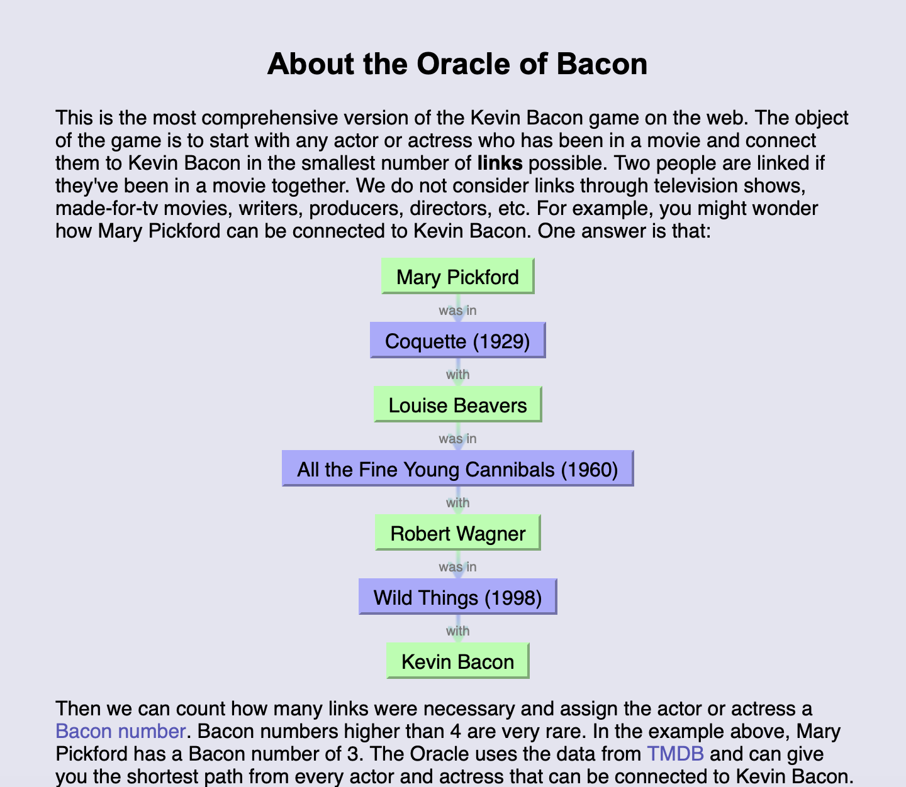
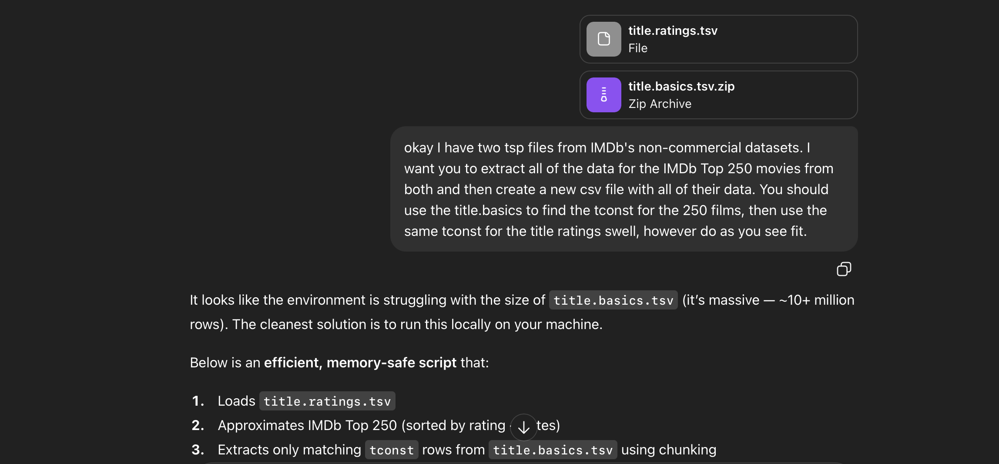

# Visualisation and Sensing 2026

## Background
General idea - initally wanted to recreate the "Oracle of Bacon" Game but there exists a website that does this[^1].

I've also been watching some of the imdb's top 250 movies but i didnt like how most were very old and didnt exactly age well so i wanted to essentially rerank the list based on how well they've held up and if the movies really do have a lasting legacy or not.

## Research
TMDB's API is open source whilst IMDB's is slightly more restricted.

## Project Process & Design
Started by trying to find public API's during Week 2's homework.
Used IMDb's Non commercial Datasets[^2], then used ChatGPT to return only top 250 movies[^3].

Found a Letterboxd webscraper that i plan to use to pull letterboxd ratings[^4].

Decided to include Rotten Tomato and Metacritic scores using OMDb's API[^5].

thinking of categorising the movies into sub groups, then printing the full list on another page.
i like the look of the nba draft ranking posts on tiktok
add a section for my own personal rankings as i watch them using my ranking scale (1-4)
data conclusion is very important at the end - what does the new ranking tell us?

## Final Visualisation
 insert link or video here.

## References and Links
[^1]: Reynolds, P., 1999. The Oracle of Bacon. [Online] 
Available at: https://www.oracleofbacon.org
[Accessed 20 February 2026].
[^2]: IMDB.com, Inc., 1990. IMDb Non-Commercial Datasets. [Online] 
Available at: https://developer.imdb.com/non-commercial-datasets/
[Accessed 24 February 2026].
[^3]: OpenAI. (2025). ChatGPT (Feb 24 version) [Large language model]. [Online]
[^4]: r/nmcassa, 2022. letterboxdpy. [Online] 
Available at: https://github.com/nmcassa/letterboxdpy
[Accessed 24 February 2026].
[^5]: Fritz, B., 2015. OMDb API. [Online] 
Available at: https://www.omdbapi.com
[Accessed 24 February 2026].

